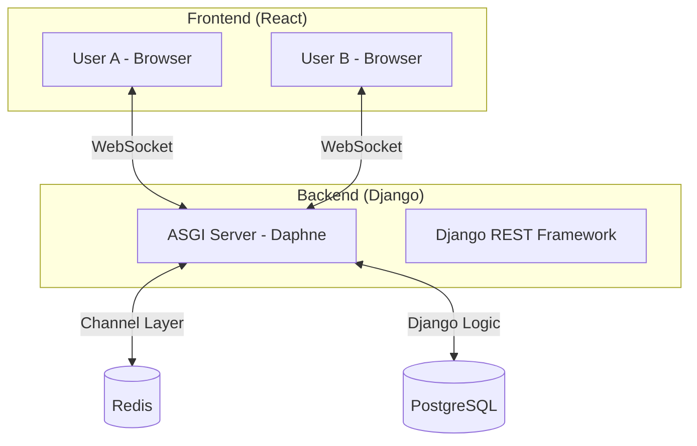

# <p align="center"><a href="https://git.io/typing-svg"></a></p>

A modern, high-performance Kanban board designed for real-time team collaboration. Built with a robust backend and a dynamic frontend to ensure seamless task management.

---

## 🚀 Deployment & Screenshots

### 🌐 Live Demo
> **http://kanban-frontend-13.232.82.42.s3-website.ap-south-1.amazonaws.com/login**

### 📸 Screenshots
| Board View | Task Details |
| :---: | :---: |
|  | ( |


---

## 🏗️ Project Architecture

The application follows a real-time event-driven architecture using WebSockets for live updates across all connected clients.



---

## 🛠️ Tech Stack

### Frontend
- **Framework:** [React 19](https://react.dev/)
- **Bundler:** [Vite](https://vitejs.dev/)
- **Styling:** [Tailwind CSS](https://tailwindcss.com/)
- **Drag & Drop:** [@hello-pangea/dnd](https://github.com/hello-pangea/dnd)
- **Icons:** [Lucide React](https://lucide.dev/)

### Backend
- **Core:** [Django 5.0+](https://www.djangoproject.com/)
- **API:** [Django REST Framework](https://www.django-rest-framework.org/)
- **Real-Time:** [Django Channels](https://channels.readthedocs.io/)
- **Authentication:** JWT (Simple JWT)
- **Database:** [PostgreSQL](https://www.postgresql.org/)
- **Caching/Queue:** [Redis](https://redis.io/)

---

## ⚙️ Setup Instructions

### Prerequisites
- Python 3.10+
- Node.js 18+
- Docker & Docker Compose (Optional)
- PostgreSQL & Redis

### 🐳 Quick Start with Docker
The easiest way to get started is using Docker Compose:

```bash
cd livesync-kanban
docker-compose up --build
```
The app will be available at `http://localhost:5173`.

### 🛠️ Manual Installation

#### 1. Backend Setup
```bash
cd livesync-kanban/backend
python -m venv venv
source venv/bin/activate  # On Windows: venv\Scripts\activate
pip install -r requirements.txt
python manage.py migrate
python manage.py runserver
```

#### 2. Frontend Setup
```bash
cd livesync-kanban/frontend
npm install
npm run dev
```

---

## 🤝 Contributing
Contributions are welcome! Please feel free to submit a Pull Request.

## 📄 License
This project is licensed under the MIT License.
